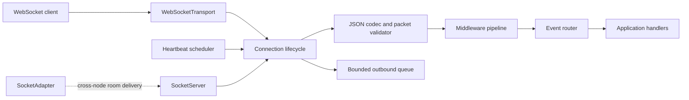

# subatom-pulse

[](https://www.npmjs.com/package/subatom-pulse)
[](https://nodejs.org/)
[](LICENSE)
[](package.json)

`subatom-pulse` is an ESM TypeScript WebSocket engine for Node.js applications that need isolated connections, named events, acknowledgements, rooms, middleware, authentication hooks, bounded delivery queues, heartbeat cleanup, and graceful shutdown.

It uses native WebSockets through [`ws`](https://github.com/websockets/ws). It is not Socket.IO-compatible: the protocol is JSON-based WebSocket traffic with no HTTP polling or transport fallback.

## Requirements

- Node.js 24 or newer
- TypeScript 5 or newer for TypeScript consumers
- A TLS-terminating proxy or HTTPS server for browser-facing production traffic

## Zero-Config Quickstart

```ts
import { subatomPulse } from "subatom-pulse";

const io = subatomPulse();

io.onConnection((socket) => {
  socket.on("greeting", (data, acknowledge) => {
    acknowledge?.({ received: true, data });
  });
});

io.installSignalHandlers();
```

The default listener uses port `8080` and accepts connections. Production services should always provide an authenticator and explicit resource limits:

```ts
import http from "node:http";
import { subatomPulse } from "subatom-pulse";

const httpServer = http.createServer();
const io = subatomPulse({
  server: httpServer,
  path: "/ws",
  maxConnections: 10_000,
  maxPayloadBytes: 1_048_576,
  rateLimitPerSec: 100,
  authenticator: async (request) => {
    const authenticated = request.headers.authorization === "Bearer service-token";
    return { authenticated };
  },
});

io.onConnection((socket) => {
  socket.emit("ready", { connectionId: socket.id });
});

httpServer.listen(3000);
io.installSignalHandlers();
```

## Architecture



Each connection owns its transport, lifecycle state, room membership cleanup, event registrations, heartbeat tracking, and bounded outbound queue. The server owns admission control, middleware, routing, aggregate metrics, adapter subscription, and shutdown coordination.

## Enterprise Guarantees

The library provides these local process guarantees when configured with valid limits:

- **Bounded memory:** inbound payload, connection count, message rate, queue message count, and queue byte limits are enforced.
- **Backpressure policy:** `reject`, `drop-oldest`, `drop-newest`, and `disconnect` are explicit per-connection policies.
- **Graceful drain:** accepted outbound frames are flushed before a connection closes during normal shutdown; new frames are rejected once draining starts.
- **Zombie cleanup:** periodic ping/pong checks terminate connections that miss their heartbeat deadline.
- **Lifecycle cleanup:** transport listeners, room membership, scoped handlers, heartbeat state, and queued delivery state are released exactly once.
- **Authentication boundary:** upgrade authentication runs before a connection is initialized and has a deadline.
- **Failure isolation:** handler, middleware, adapter, and listener failures are contained and surfaced through diagnostics or protocol errors.
- **Signal coordination:** `installSignalHandlers()` installs idempotent `SIGTERM` and `SIGINT` handlers without changing process behavior merely by importing the package.

These guarantees do not provide durable messaging, global presence, exactly-once delivery, or broker-level ordering. Those require an application-owned adapter and persistence strategy.

## Configuration

| Option | Default | Production purpose |
| --- | ---: | --- |
| `path` | `/` | WebSocket upgrade path. |
| `port` | `8080` | Standalone listener port; use `0` for an ephemeral test port. |
| `server` | `null` | Existing Node HTTP/HTTPS server for TLS and health endpoints. |
| `maxPayloadBytes` | `1048576` | Maximum inbound WebSocket frame size. |
| `maxConnections` | `10000` | Admission limit with headroom for reconnects. |
| `rateLimitPerSec` | `100` | Inbound packets per connection per second. |
| `maxQueueMessages` | `1000` | Maximum pending outbound messages per connection. |
| `maxQueueBytes` | `4194304` | Maximum pending outbound bytes per connection. |
| `overflowPolicy` | `reject` | Slow-client behavior: `reject`, `drop-oldest`, `drop-newest`, or `disconnect`. |
| `heartbeatIntervalMs` | `30000` | Interval between liveness scans. |
| `heartbeatTimeoutMs` | `5000` | Time allowed for a pong response. |
| `authTimeoutMs` | `5000` | Maximum authenticator duration. |
| `shutdownTimeoutMs` | `10000` | Graceful drain deadline before termination. |
| `adapter` | `LocalAdapter` | In-memory adapter by default; use a shared adapter across nodes. |
| `nodeId` | `local` | Unique origin identifier for a shared adapter. |

For browser clients, validate `Origin` in `authenticator`, use `wss://`, and avoid long-lived bearer tokens in query strings. The convenience client token option uses a query parameter because WebSocket browser constructors cannot set arbitrary authorization headers.

## Scaling and Delivery Semantics

`LocalAdapter` is process-local. For multiple processes or containers, implement `SocketAdapter` with a shared broker and a unique `nodeId` per instance. Room membership remains local; the adapter distributes room packets to each node's local members.

The adapter contract is publish/subscribe, not a durable queue. Applications requiring replay, ordering across reconnects, deduplication, or exactly-once business effects must add message identifiers and persistence at the application or broker layer.

## Performance Benchmarks

The repository includes deterministic hardening checks rather than hardware-independent throughput claims:

| Scenario | Acceptance result |
| --- | --- |
| Graceful drain of 256 concurrent connections | Every accepted frame is sent, every queue reaches `closed`, and every transport receives the requested close code. |
| Heartbeat registration churn of 1,000 connections | All registrations are released; no stale ping or termination is issued after unregister. |
| Full unit and integration suite | 100% statements, branches, functions, and lines under the configured Vitest thresholds. |

Run the reproducible checks locally:

```bash
npm run typecheck
npm run test:coverage
npm run build
npm run check
```

Throughput and latency depend on payload size, handler work, proxy settings, CPU, and adapter behavior. Benchmark your deployment topology before setting capacity targets.

## Operations

Use a proxy with WebSocket upgrade support, disable buffering on the WebSocket route, and set its idle timeout above `heartbeatIntervalMs + heartbeatTimeoutMs`. Monitor `activeConnections`, `messagesReceived`, `messagesSent`, `messageErrors`, `queueOverflows`, `droppedBytes`, and `adapterErrors`.

Call `installSignalHandlers()` once per server instance. It drains active connections, terminates those that exceed `shutdownTimeoutMs`, closes the adapter, and closes an attached HTTP server after the WebSocket server is drained. The returned cleanup function removes the process listeners.

## Development

```bash
npm install
npm run typecheck
npm test
npm run test:coverage
npm run check
npm run build
```

Formatting uses Biome with tabs and double quotes. Tests live under `test/` and use Vitest.

## Contributing

Please read [CODE_OF_CONDUCT.md](CODE_OF_CONDUCT.md) before participating. Contributions should include focused tests for lifecycle, delivery, security, or protocol changes and should keep the public export surface backward compatible.

Before opening a pull request, run the complete validation commands above. Do not commit generated `coverage/` or `dist/` output.

## License

MIT. See [LICENSE](LICENSE).
